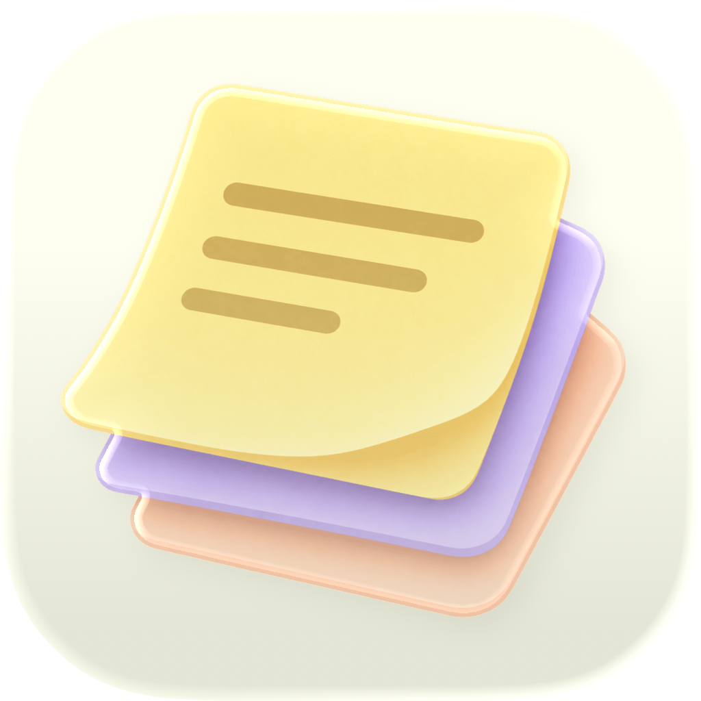

  
  <h1>Pocket Stack</h1>
  
<em>An ambient, edge-docked note companion for macOS. Always at hand, never in the way.</em>

  
  
  
  
  

---

## Why Pocket Stack?

Traditional note applications demand too much space and friction: they require dedicated main windows, clutter your Dock, or force you into a browser tab. Native Sticky notes, on the other hand, quickly sprawl into a messy constellation across your desktop.

**Pocket Stack** takes inspiration from a physical desktop organizer:

- **Quietly docked at screen edges:** Your notes rest tucked at the screen border (Bottom, Left, or Right) until you need them.
- **Fluid transitions:** Hovering the edge fans out your note stack; hovering a tab shows an instant live preview; clicking detaches it into a focused floating window.
- **Zero distraction:** As an accessory app (`LSUIElement`), it lives ambiently on your desktop without an intrusive Dock icon or interrupting your active workspace.

---

## Features

- **🎴 Edge-Docked Deck & NoteFan:**
  - Multi-state interaction: **Rest** (unobtrusive edge tabs), **Fan** (stacked colored cards showing titles), **Preview** (seamless hover preview), and **Floating Window** (draggable scratchpad).
  - Supports Bottom, Left, and Right screen edges across one or all connected displays.

- **✍️ Typora-Style Live Markdown:**
  - True WYSIWYG live rendering powered by TextKit 2.
  - Full support for GitHub Flavored Markdown (GFM), syntax-highlighted code blocks, LaTeX math formulas, checklists, tables, and images.

- **🎙️ Realtime Dual-Engine Dictation:**
  - **Apple On-Device Speech:** 100% offline, zero latency, completely private.
  - **Gemini Live AI:** Streaming real-time transcription via WebSocket PCM audio for enhanced accuracy.
  - Transcribes text directly at your cursor in the active editor.

- **🔒 Local-First & AES-GCM Encrypted:**
  - All data is stored locally in SQLite running in WAL mode.
  - Note bodies are encrypted with a random **256-bit AES-GCM** key managed in **Apple Keychain**.
  - No tracking, telemetry, or remote transmission without your consent.

- **📦 Flexible Import & Export:**
  - Import and export individual Markdown files, plain text, combined master documents, or Apple `.stickies` JSON archives.

---

## Quick Start

### Requirements
- macOS 14.0 (Sonoma) or newer.

### Install & Launch

1. Download the latest release from the [Releases](https://github.com/your-org/pocket-stack/releases) page.
2. Drag **Pocket Stack.app** to your `/Applications` folder.
3. Open the app. Pocket Stack will appear as an ambient deck along your screen edge.

*Or build directly from source using Xcode 16+ (see [Building & Development](docs/development.md)).*

---

## Usage & Shortcuts

| Action | Shortcut / Gesture | Description |
| :--- | :--- | :--- |
| **New Note** | `⌥⌘N` | Instantly creates a new note card in your deck |
| **All Notes / Library** | `⌥⌘A` | Opens your library search and archived notes |
| **Archive Note** | `⌥⌘L` | Archives the currently focused note |
| **Reveal Deck** | `Hover Screen Edge` | Fans out note tabs showing color and title |
| **Quick Peek** | `Hover Note Tab` | Expands note into a live content preview |
| **Detach Note** | `Drag Tab` | Pulls the tab out into a free-floating desktop window |
| **Dismiss / Rest** | `Click Outside` | Neatly retracts the fan back to the screen border |

---

## Documentation

For developers, contributors, and deep-dive technical references:

- [Architecture & Security Overview](docs/architecture.md) — Layered Clean Architecture, SQLite WAL mode, AES-GCM Keychain storage, and TextKit 2 integration.
- [Voice Dictation Setup](docs/dictation.md) — Apple SpeechAnalyzer vs Gemini Live streaming setup and Keychain key configuration.
- [Building & Development](docs/development.md) — Toolchain requirements, Xcode schemes, command-line builds, sandboxing, and distribution.
- [Deck Terminology](DECK_TERMINOLOGY.md) — UI terminology, geometry conventions, and layout rules for NoteFan and previews.

---

## Attribution

The deck interaction model and foundational layout concepts are derived from [Noty](https://github.com/aimen08/noty), available under the MIT License. The third-party license notice is preserved in `Pocket Stack/Resources/THIRD-PARTY-NOTICES.txt`.

---

## License

Distributed under the [MIT License](LICENSE). Feel free to use, study, and build upon it!
