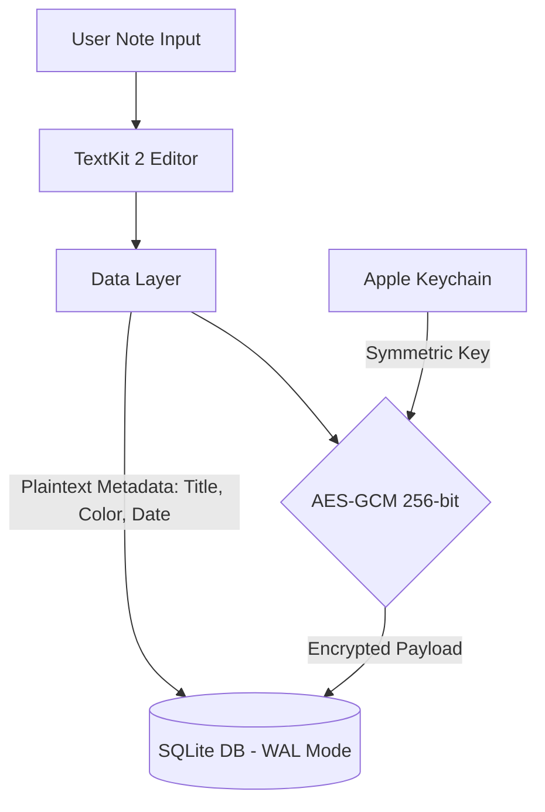

# Pocket Stack Architecture

Pocket Stack is designed as an ambient macOS accessory app built with Swift, SwiftUI, and AppKit. It follows a modular Clean Architecture pattern with clear layer boundaries and strict data isolation.

---

## Layers & Structure

The codebase is organized into file-system synchronized groups separated by responsibility:

```
Pocket Stack/
├── Domain/          # Core value models and protocols (No UI, DB, or audio imports)
├── Data/            # SQLite repository, AES-GCM encryption, transfer codecs
├── Platform/        # Keychain, CoreAudio, Apple Speech, Gemini WebSocket client
├── Features/        # SwiftUI views, AppKit panels, edge overlays, and editors
│   ├── Deck/        # Edge-docked NoteFan, NoteTab, hover preview, gesture handling
│   ├── Editor/      # TextKit 2 Typora-style live Markdown editor
│   ├── Library/     # All notes, search, and archive management
│   └── Settings/    # Preferences, shortcuts, and dictation engine configuration
└── App/             # Dependency graph, AppModel state container, lifecycle wiring
```

### 1. `Domain`
Contains pure business logic, note models, and interface contracts (`Repository`, `DictationService`). It has zero dependencies on macOS UI frameworks, databases, or audio hardware.

### 2. `Data`
Handles persistence and data security:
- **Actor Isolation:** Database operations are isolated to an asynchronous Swift actor to prevent concurrent access issues.
- **SQLite in WAL Mode:** Configured for high-throughput concurrent reads and writes with minimal lock contention.
- **Payload Encryption:** Note bodies are encrypted with **AES-GCM (256-bit key)**. Note titles, colors, and timestamps are stored in plaintext so note stacks and list previews can render instantly without decrypting every body.

### 3. `Platform`
Encapsulates system hardware, OS services, and network integrations:
- **Keychain Access:** Safely manages encryption keys and API tokens.
- **Audio Capture & Conversion:** CoreAudio capture pipelines converting live input into standard PCM streams.
- **Speech Engines:** Integrations for Apple on-device SpeechAnalyzer and Gemini Live WebSockets.

### 4. `Features`
Contains all user interface components:
- **Deck & Overlays:** Low-overhead AppKit panels (`NSPanel`) that float above normal desktop windows at screen edges (Bottom, Left, Right) without stealing system focus unless interacted with.
- **Markdown Editor:** Native TextKit 2-based live markdown editor rendering GFM, code syntax highlighting, LaTeX math formulas, checklists, and tables.

### 5. `App`
Coordinates the global state (`AppModel`), dependency injection, application lifecycle, global hotkeys, and system menu bar integrations.

---

## Security & Storage Model



1. **Local-First & Offline:** Notes live 100% on your Mac. No incoming open sockets, no background cloud telemetry, and no remote syncing without explicit user action.
2. **Encryption at Rest:**
   - Note body content is encrypted with a random 256-bit AES-GCM key.
   - The master encryption key is generated on first launch and stored securely in macOS **Keychain Services**.
   - Gemini API keys (if used) are stored separately in the Keychain.
